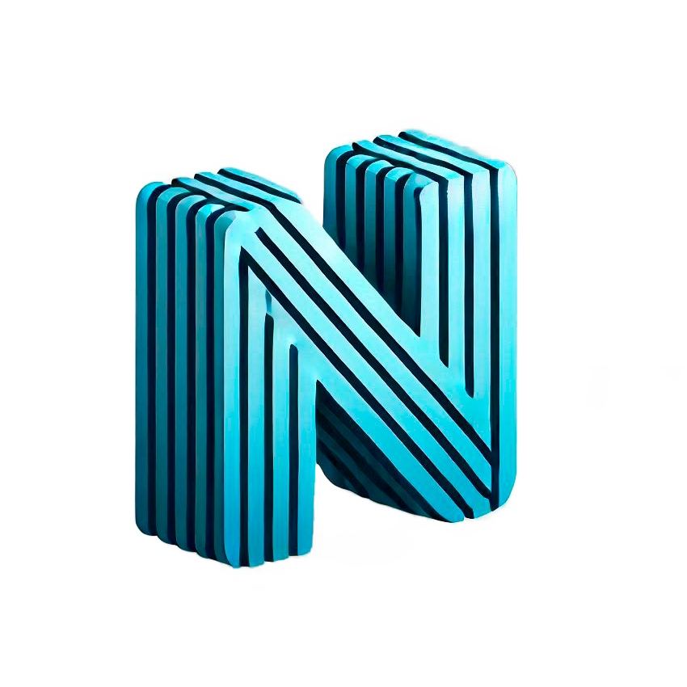

<div align="center">
    
</div>

# News Portal 

This is a demo project built with Laravel, Reverb, Inertia.js and Vue.js. RabbitMQ is here just for example. Telegram bot is used to verify user accounts. News page, dashboard and user profile are updated automatically in all open browser tabs/windows.

## How to run locally

### 1. Copy dev.docker-compose.yaml to docker-compose.yaml
```bash
cp dev.docker-compose.yaml docker-compose.yaml
```
Check docker-compose.yaml if you want to change some numbers.

### 2. Copy .env.example to .env and fill in some values there:
```bash
cp .env.example .env
```
  - You will need your Telegram bot (see https://core.telegram.org/bots/features#botfather).  
    Fill in __TELEGRAM_BOT_USERNAME__ and __TELEGRAM_BOT_TOKEN__.

  - Fill in __REVERB_APP_KEY__ and __REVERB_APP_SECRET__ with random strings.

  - Next, you need account on https://newsapi.org. Get your API Key there and paste it into __NEWSAPI_ORG_KEY__.

### 3. Run in console:

```bash
docker compose run --rm app sh -c "composer install && php artisan key:generate && php artisan migrate --seed"
docker compose run --rm npm npm install
docker compose up -d

```
### 4. Now open http://localhost:8080 in your browser
and log in using test@example.com : 12345678. Also, you can click Register link and check how registration works.  
There is a special user guest@example.com who cannot change his name, email and password.

RabbitMQ dashboard is here: http://localhost:15672 (guest : guest)

## Testing

docker compose exec app php artisan test

## License

This open-sourced software licensed under the [MIT license](https://opensource.org/licenses/MIT).
